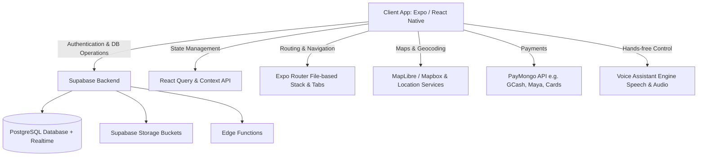

# Overview & Architecture: Commute Companion

**Commute Companion** is a React Native cross-platform mobile application built on **Expo (v56)** and powered by a **Supabase** backend. It offers a comprehensive carpooling, ride-sharing, and community ecosystem designed to streamline daily travel, reduce transportation costs, lower carbon emissions, and connect commuters.

---

## High-Level System Architecture

### Core Technologies
- **Framework & Runtime:** React Native `0.85`, Expo `~56.0` with `expo-router` (file-based navigation stack and tab architecture).
- **Backend & Database:** Supabase (`@supabase/supabase-js`), PostgreSQL with Row-Level Security (RLS), Supabase Storage, and Realtime Subscriptions.
- **State Management & Caching:** `@tanstack/react-query` for server state, React Context API for global state (`AuthContext`, `ThemeContext`, `RouteContext`, `VoiceAssistantContext`, `NotificationContext`).
- **Mapping & Geolocations:** `@maplibre/maplibre-react-native`, `react-native-maps`, `expo-location`, Mapbox polyline encoding (`@mapbox/polyline`).
- **Voice Assistant:** Custom hands-free assistant built with `expo-speech` (TTS), `expo-audio`, and natural language intent parsing.
- **Payments Integration:** PayMongo API integration (`src/services/paymongo.ts`) for mobile e-wallets (GCash, PayMaya, GrabPay) and card checkout.
- **UI & Animations:** `@gorhom/bottom-sheet`, `react-native-reanimated`, `expo-linear-gradient`, Google Inter & Outfit fonts, dark/light theme engine.

---

## Application Page & Route Architecture

The app uses `expo-router` with two main navigation groups: `(auth)` for authentication & onboarding flow, and `(main)` for authenticated core features.

### 1. Root Setup & Layouts
- **`app/_layout.tsx`**: Root application wrapper. Initializes global providers (`QueryClientProvider`, `ThemeProvider`, `ToastProvider`, `AuthProvider`, `RouteProvider`, `VoiceAssistantProvider`), loads Google fonts (`Inter`, `Outfit`), manages splash screen hiding, and handles authentication state redirection logic. Includes the global floating `VoiceAssistantFab` and `VoiceAssistantSheet`.

---

### 2. Authentication & Onboarding Stack (`(auth)`)
- **`app/(auth)/_layout.tsx`**: Stack navigator for unauthenticated flows.

| Route Path | Screen File | Page Architecture & Description | Key Interactions & Services |
| :--- | :--- | :--- | :--- |
| `/(auth)/welcome` | `app/(auth)/welcome.tsx` | **Welcome Screen:** Entry point for new or unauthenticated users. Features hero graphics, app value propositions, and primary actions to sign in or get started. | Navigates to `sign-in` or `onboarding`. |
| `/(auth)/onboarding` | `app/(auth)/onboarding.tsx` | **Onboarding Carousel:** Interactive multi-step feature showcase explaining ride sharing, live route tracking, community hub, and safety. | Stores completion flag in `AsyncStorage` (`@onboarding_complete`). |
| `/(auth)/sign-in` | `app/(auth)/sign-in.tsx` | **Sign In Screen:** Form allowing existing users to log in with email and password, toggle password visibility, and remember email. | Calls `signIn()` in `AuthContext` via `services/auth.ts`. |
| `/(auth)/sign-up` | `app/(auth)/sign-up.tsx` | **Sign Up Screen:** Account creation form supporting user role selection (**Commuter** vs **Driver**), profile info, phone number, and password setup. | Calls `signUp()` in `AuthContext` and creates initial user profile record in database. |
| `/(auth)/forgot-password` | `app/(auth)/forgot-password.tsx` | **Forgot Password Screen:** Password recovery screen allowing users to request a password reset email link. | Triggers Supabase password reset link via `resetPassword()`. |
| `/(auth)/verify-email` | `app/(auth)/verify-email.tsx` | **Email Verification Screen (Soft Gate):** Verification screen checking if user email is confirmed, with actions to resend verification or "Skip for now". | Checks `email_confirmed_at` status and stores `@skipped_verification` in `AsyncStorage`. |

---

### 3. Main Bottom Tab Bar (`(main)/(tabs)`)
- **`app/(main)/(tabs)/_layout.tsx`**: Floating glassmorphism tab bar with active icon spring animations, dynamic badge counters for driver requests and upcoming rides, and haptic feedback.

| Tab Name | Screen File | Page Architecture & Description | Key Components & State |
| :--- | :--- | :--- | :--- |
| **Home** (`index`) | `app/(main)/(tabs)/index.tsx` | **Home Dashboard:** Main hub featuring map view, route search bar, active commute banner, quick action tiles (Offer a Ride, Find a Ride, Voice Assistant), vehicle status (for drivers), and saved routes. | Renders `MapLibre`/`RNMaps`, integrates `RouteContext` and `VoiceAssistantContext`. |
| **Rides** (`rides`) | `app/(main)/(tabs)/rides.tsx` | **Ride Discovery & Driver Management:** Dual-mode screen. Commuters browse & filter available rides (time, price, seats). Drivers view created trips, manage seat availability, and respond to booking requests. | React Query hooks (`useQuery`, `useMutation`) for `trips.ts` & `bookings.ts`. Tab badges alert driver of pending bookings. |
| **Hub** (`community`) | `app/(main)/(tabs)/community.tsx` | **Community Hub Feed:** Social feed where commuters post real-time traffic updates, carpool requests, and tips. Supports category filter tags, likes, and comment threads. | Renders post list cards, category selector (`AnimatedSegmentControl`), connects to `hubPosts.ts`. |
| **Activity** (`activity`) | `app/(main)/(tabs)/activity.tsx` | **Ride History & Bookings:** Timeline of user's past and upcoming booked rides, booking status badges (Pending, Confirmed, Completed, Cancelled), fare breakdowns, and trip details. | Fetches user trip history via `trips.ts` and `bookings.ts`, provides direct links to trip summaries and chats. |
| **Profile** (`profile`) | `app/(main)/(tabs)/profile.tsx` | **User Profile & Stats:** User dashboard displaying avatar, eco-stats (carbon saved, total rides, rating), driver status, verification badge, and quick navigation to settings. | Displays `profile` state from `AuthContext`, links to edit profile, vehicle management, and ID verification. |

---

### 4. Ride Management & Booking Stack (`(main)/ride`)

| Route Path | Screen File | Page Architecture & Description | Key Operations & Interactions |
| :--- | :--- | :--- | :--- |
| `/ride/set-route` | `app/(main)/ride/set-route.tsx` | **Route Selection Map:** Interactive map screen to choose origin and destination points, search addresses via geocoding service, preview polyline route, distance, and ETA. | Geocoding via `geocoding.ts`, stores route selection in `RouteContext`. |
| `/ride/create` | `app/(main)/ride/create.tsx` | **Ride Creation Flow (Drivers):** Multi-step form for drivers to post a new trip offer (departure time, available seats, fare per seat, vehicle selection, recurring days, route notes). | Inserts new trip record via `trips.ts`, validates vehicle selection. |
| `/ride/[id]` | `app/(main)/ride/[id].tsx` | **Trip Details View:** Complete breakdown of a specific ride offer. Shows map route, pickup points, driver info, vehicle specs, passenger roster, and primary action button (**Book Ride** or **Manage Trip**). | Real-time trip status fetching via `trips.ts`, opens booking modal. |
| `/ride/book/[id]` | `app/(main)/ride/book/[id].tsx` | **Booking Request Screen:** Screen/modal for commuters to select number of seats, specify pickup/dropoff points along route, choose payment method, and send booking request to driver. | Creates booking request via `bookings.ts` and triggers push notification to driver. |
| `/ride/review/[id]` | `app/(main)/ride/review/[id].tsx` | **Ride Rating & Review:** Post-trip evaluation screen where passengers and drivers rate each other (1-5 stars), add feedback tags, and submit text reviews. | Submits feedback via `reviews.ts` and updates aggregate driver rating. |
| `/ride/trip-summary` | `app/(main)/ride/trip-summary.tsx` | **Trip Receipt & Impact Summary:** Displays trip completion confirmation, total distance traveled, carbon footprint saved, final fare, and receipt invoice. | Summarizes completed trip data and payment confirmation. |

---

### 5. Community & Chat Stack (`(main)/hub` & `(main)/chat`)

| Route Path | Screen File | Page Architecture & Description | Key Operations & Interactions |
| :--- | :--- | :--- | :--- |
| `/hub/create-post` | `app/(main)/hub/create-post.tsx` | **Create Community Post:** Modal form to post announcements or carpool requests to the Hub. Supports category selection, image upload, and location tagging. | Uploads image to Supabase storage bucket (`storage.ts`) and posts via `hubPosts.ts`. |
| `/chat/[id]` | `app/(main)/chat/[id].tsx` | **Real-time Ride Chat:** One-on-one or group chat room between driver and passengers for a specific ride. Supports real-time text messages, voice messages, location sharing, and quick trip status updates. | Listens to Supabase Realtime channel subscriptions (`messages.ts` / `chatRooms.ts`). |

---

### 6. Payments Stack (`(main)/payment`)

| Route Path | Screen File | Page Architecture & Description | Key Operations & Interactions |
| :--- | :--- | :--- | :--- |
| `/payment/pay-fees` | `app/(main)/payment/pay-fees.tsx` | **Checkout & Fee Payment:** Payment checkout page integrated with PayMongo API. Supports payment methods including GCash, PayMaya, GrabPay, and Credit/Debit Cards with live payment status verification. | Interacts with `paymongo.ts` service, handles webhook/polling status checks, displays payment receipt. |

---

### 7. User Settings & Driver Registration (`(main)/settings`)

| Route Path | Screen File | Page Architecture & Description | Key Operations & Interactions |
| :--- | :--- | :--- | :--- |
| `/settings/edit-profile` | `app/(main)/settings/edit-profile.tsx` | **Edit Profile:** Update full name, phone number, bio, and upload avatar photo. | Modifies profile record via `profiles.ts` and updates `AuthContext`. |
| `/settings/vehicle` | `app/(main)/settings/vehicle.tsx` | **Vehicle Management:** Screen for drivers to manage vehicle records (make, model, color, license plate, seat capacity, vehicle photo). | Manages vehicle data via `vehicles.ts`. |
| `/settings/become-driver` | `app/(main)/settings/become-driver.tsx` | **Driver Onboarding & Verification:** Flow for commuters to apply as drivers by providing driver's license details, vehicle info, and submitting identity documents for admin approval. | Updates user role request and triggers verification workflow. |
| `/settings/notifications` | `app/(main)/settings/notifications.tsx` | **Notification Preferences:** Toggle settings for push notifications, ride status alerts, community updates, and sound/vibration preferences. | Persists user preferences via `notifications.ts`. |

---

### 8. Identity Verification Stack (`(main)/verification`)

| Route Path | Screen File | Page Architecture & Description | Key Operations & Interactions |
| :--- | :--- | :--- | :--- |
| `/verification` | `app/(main)/verification/index.tsx` | **Verification Status Dashboard:** Displays user ID verification status (Unverified, Pending Verification, Verified, or Action Required). | Reads verification status from `profiles.ts`. |
| `/verification/upload-id` | `app/(main)/verification/upload-id.tsx` | **Document Scanner & Upload:** Interface to capture/upload government ID photos and driver's licenses for identity verification. | Uses `expo-image-picker`, uploads file to Supabase storage (`storage.ts`), submits verification request. |

---

### 9. Notification Center & Voice Assistant Overlay

| Route Path / Layer | Screen File | Page Architecture & Description | Key Operations & Interactions |
| :--- | :--- | :--- | :--- |
| `/notification-inbox` | `app/(main)/notification-inbox.tsx` | **Notification Center:** Centralized inbox displaying system notifications, ride request alerts, booking confirmations, and chat alerts with mark-as-read options. | Uses `NotificationContext` and `services/notifications.ts`. |
| `/assistant-demo` | `app/(main)/assistant-demo.tsx` | **Voice Assistant Interactive Playground:** Demo and testing page for hands-free voice commands, TTS output, route querying via voice, and assistant customization. | Connects to `VoiceAssistantContext`, `expo-speech`, and `expo-audio`. |
| **Global Overlay** | `src/components/assistant/VoiceAssistantFab.tsx` | **Global Voice Action Button:** Floating button visible across all main screens for quick hands-free activation. | Opens `VoiceAssistantSheet` modal. |
| **Global Overlay** | `src/components/assistant/VoiceAssistantSheet.tsx` | **Voice Assistant Bottom Sheet:** Sheet UI rendering live speech wave animations, transcription, intent execution results, and quick action chips. | Driven by `VoiceAssistantContext`. |
