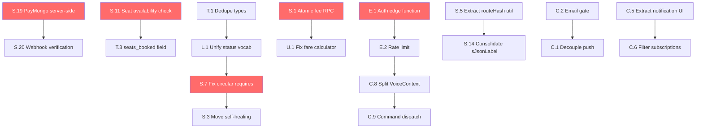

# Commute Companion — Module-by-Module Improvement Roadmap

> **Generated**: 2026-06-13 — Full codebase audit  
> **Scope**: Every file in `src/`, `app/`, `supabase/`, and `admin/`

---

## How to Read This Document

Each section covers one **layer** of the architecture. Within each layer, every file is listed with:
- 🔴 **Critical** — Breaks correctness, security, or data integrity
- 🟡 **High** — Degrades UX or maintainability significantly
- 🟢 **Medium** — Code quality, DRY, or future-proofing
- 🔵 **Low** — Nice-to-have polish

---

## Layer 1 — Types (`src/types/`)

### [database.ts](file:///c:/Users/Donmarvs/Documents/My%20Games/commute-companion/src/types/database.ts)

| # | Issue | Severity | What to Do |
|---|-------|----------|------------|
| T.1 | **Duplicate `Route` and `Community` interfaces** (lines 131-144 are duplicated at lines 154-175) | 🔴 Critical | Delete the duplicate block (lines 154-175). This can cause subtle merge conflicts and confusion. |
| T.2 | **`Booking.status` type doesn't match `constants.ts`** — Type says `'pending' \| 'accepted' \| 'rejected' \| 'completed'` but `BOOKING_STATUSES` in constants says `'pending' \| 'confirmed' \| 'rejected' \| 'cancelled' \| 'completed'`. | 🔴 Critical | Unify to a single source of truth. Derive the type from the const tuple: `type BookingStatus = typeof BOOKING_STATUSES[number]`. |
| T.3 | **Missing `seats_booked` field on Booking** — The app calculates seats from `fare_paid / fare_per_seat`, which is fragile. | 🟡 High | Add `seats_booked: number` to both the `Booking` interface and the Supabase table. |
| T.4 | **Missing `verification_status` field on Profile** — Currently uses a simple `is_verified` boolean with no review pipeline. | 🟡 High | Add `verification_status: 'none' \| 'pending' \| 'approved' \| 'rejected'` to Profile. |
| T.5 | **`Vehicle.capacity` is `string` instead of `number`** — Forces `parseInt()` at every usage site. | 🟢 Medium | Change to `capacity: number`. Update DB column and all consumers. |
| T.6 | **No `pickup_label` / `dropoff_label` on Booking** — Only stores lat/lng, making the UI reverse-geocode on every render. | 🟢 Medium | Add `pickup_label` and `dropoff_label` string fields. Populate on booking creation. |

---

## Layer 2 — Theme (`src/theme/`)

### [colors.ts](file:///c:/Users/Donmarvs/Documents/My%20Games/commute-companion/src/theme/colors.ts)

| # | Issue | Severity | What to Do |
|---|-------|----------|------------|
| TH.1 | **Extracta preset has identical light/dark colors** — `extractaDark` just spreads `extractaLight` with no overrides, making dark mode indistinguishable from light. | 🟡 High | Either intentionally document this is a single-mode theme (dark-only), or create differentiated light/dark variants. Consider making the light mode use `#FFFFFF` background with `#030303` text. |
| TH.2 | **`ACTIVE_PRESET` is `export let`** — This is a mutable module-level variable. Changing it at runtime won't re-evaluate the computed `lightColors`/`darkColors` exports. | 🟡 High | Refactor to make theme selection reactive. Move preset selection into `ThemeContext` and compute colors there, or use a function `getColors(preset)`. |
| TH.3 | **No runtime theme switching** — The ternary chains for `lightColors`/`darkColors` are evaluated once at import time. | 🟢 Medium | Convert to a `getThemeColors(preset: ThemePreset)` function called from `ThemeContext`. |

### [typography.ts](file:///c:/Users/Donmarvs/Documents/My%20Games/commute-companion/src/theme/typography.ts)

| # | Issue | Severity | What to Do |
|---|-------|----------|------------|
| TH.4 | **Extracta design specifies JetBrains Mono but typography uses Inter/Outfit** — If you want the Extracta preset to truly match, typography should also vary by preset. | 🟢 Medium | Either add preset-aware typography (e.g., `getTypography(preset)`) or keep Inter/Outfit as the app's system fonts regardless of color preset. |
| TH.5 | **No `letterSpacing` tokens** — The Extracta design specifies `letterSpacing: 0` for display text, but typography has no letter-spacing support. | 🔵 Low | Add optional `letterSpacing` to each typography level. |

### [spacing.ts](file:///c:/Users/Donmarvs/Documents/My%20Games/commute-companion/src/theme/spacing.ts)

| # | Issue | Severity | What to Do |
|---|-------|----------|------------|
| TH.6 | **Extracta radii are very small (1-2px)** which will look odd on rounded pill buttons and avatars. | 🟢 Medium | Verify the visual output. Consider keeping `full: 9999` as-is but bumping `sm`/`md` to at least 4/6 if pill-like controls look wrong. |

### [index.ts](file:///c:/Users/Donmarvs/Documents/My%20Games/commute-companion/src/theme/index.ts)

| # | Issue | Severity | What to Do |
|---|-------|----------|------------|
| TH.7 | **Themes are computed at module load** — `lightTheme` and `darkTheme` are static objects. Preset changes won't propagate. | 🟢 Medium | Already related to TH.2/TH.3. Convert to factory functions. |

---

## Layer 3 — Utilities (`src/utils/`)

### [fareCalculator.ts](file:///c:/Users/Donmarvs/Documents/My%20Games/commute-companion/src/utils/fareCalculator.ts)

| # | Issue | Severity | What to Do |
|---|-------|----------|------------|
| U.1 | **`costPerSeat` equals `subtotal` — no per-passenger splitting** — The `passengers` parameter is accepted but never used in the calculation. Fare is always for 1 seat. | 🔴 Critical | Decide on fare model: is `fare_per_seat` always the full subtotal? If cost-sharing is desired, divide `subtotal / Math.max(1, passengers)`. Document the chosen model. |
| U.2 | **`getDriverPayout()` math may disagree with `calculateFare()`** — `getDriverPayout` reverses the platform fee from `totalFare`, but `calculateFare` applies `Math.ceil()` on `totalPerSeat`, so the round-trip is lossy. | 🟡 High | Store `platform_fee` and `base_fare` separately on the booking record so payout doesn't need to reverse-engineer values. |

### [errorHelper.ts](file:///c:/Users/Donmarvs/Documents/My%20Games/commute-companion/src/utils/errorHelper.ts)

| # | Issue | Severity | What to Do |
|---|-------|----------|------------|
| U.3 | **No user-facing error feedback** — `handleServiceError` only logs to console. Users see nothing when API calls fail silently. | 🟡 High | Add an optional `showToast` parameter or integrate with a global toast/snackbar system. |
| U.4 | **JWT expiration triggers signOut but no UI redirect** — The signOut happens in a fire-and-forget `.catch()`. User might stay on a broken screen. | 🟢 Medium | Ensure `AuthContext`'s `onAuthStateChange` handles `SIGNED_OUT` to redirect. Verify this path end-to-end. |

### [validators.ts](file:///c:/Users/Donmarvs/Documents/My%20Games/commute-companion/src/utils/validators.ts)

| # | Issue | Severity | What to Do |
|---|-------|----------|------------|
| U.5 | **No plate number validator** — The vehicle form accepts any string. | 🟢 Medium | Add `isValidPlateNumber(plate: string)` for Philippine format (e.g., `ABC 1234` or `1234-AB`). |
| U.6 | **No username validator** — Usernames could contain spaces, special characters, or be empty. | 🟢 Medium | Add `isValidUsername()` (alphanumeric, underscores, 3-20 chars). |

### [dateFormatter.ts](file:///c:/Users/Donmarvs/Documents/My%20Games/commute-companion/src/utils/dateFormatter.ts)

| # | Issue | Severity | What to Do |
|---|-------|----------|------------|
| U.7 | **Not audited in detail** but ensure it handles timezone correctly for PH (UTC+8). | 🟢 Medium | Verify `date-fns` is formatting in the user's local timezone, not UTC. |

---

## Layer 4 — Lib (`src/lib/`)

### [constants.ts](file:///c:/Users/Donmarvs/Documents/My%20Games/commute-companion/src/lib/constants.ts)

| # | Issue | Severity | What to Do |
|---|-------|----------|------------|
| L.1 | **`BOOKING_STATUSES` includes `'confirmed'` and `'cancelled'` but `Booking` type uses `'accepted'` and has no `'cancelled'`** — Mismatch between type and const. | 🔴 Critical | Align these. Pick one vocabulary: `accepted` vs `confirmed`. Remove `cancelled` if bookings can't be cancelled directly (only trips can). |
| L.2 | **`COST_PER_MIN` comment says "0 per minute" but value is `2`** — Comment is stale. | 🟢 Medium | Fix the comment to `/** ₱2 per minute */`. |

### [supabase.ts](file:///c:/Users/Donmarvs/Documents/My%20Games/commute-companion/src/lib/supabase.ts)

| # | Issue | Severity | What to Do |
|---|-------|----------|------------|
| L.3 | **No connection error handling** — If Supabase is unreachable, the app crashes with an unhandled fetch error. | 🟡 High | Wrap initialization. Consider adding a health-check function or connection status indicator. |

---

## Layer 5 — Hooks (`src/hooks/`)

### [useLocation.ts](file:///c:/Users/Donmarvs/Documents/My%20Games/commute-companion/src/hooks/useLocation.ts)

| # | Issue | Severity | What to Do |
|---|-------|----------|------------|
| H.1 | **Runs only once** — No way to refresh location on demand (e.g., pull-to-refresh on home screen). | 🟡 High | Add a `refreshLocation()` function to the return value. |
| H.2 | **No background location watching** — For live tracking, the driver needs continuous updates but this hook only gets a one-shot position. | 🟡 High | Add `useLocationWatcher()` hook with `Location.watchPositionAsync()` for the tracking screen. |
| H.3 | **No permission denied UX** — If permission is denied, `error` is set but nothing guides the user to settings. | 🟢 Medium | Return a `permissionDenied` boolean. The consuming screen can show a "Go to Settings" prompt. |

---

## Layer 6 — Services (`src/services/`)

### [trips.ts](file:///c:/Users/Donmarvs/Documents/My%20Games/commute-companion/src/services/trips.ts)

| # | Issue | Severity | What to Do |
|---|-------|----------|------------|
| S.1 | **`updateTripStatus` has a race condition on platform fee** — It reads the driver's current balance, adds the fee, and writes back. Two concurrent completions could overwrite each other. | 🔴 Critical | Use a Supabase RPC with `UPDATE ... SET platform_fee_balance = platform_fee_balance + $1` for atomic increment. |
| S.2 | **`updateTripStatus('completed')` fetches the trip 3 separate times** — Once for bookings, once for driver fee, once for driver name. Merge into a single query. | 🟡 High | Fetch the trip with all relations in one query at the top of the function. |
| S.3 | **24-hour self-healing in `getTripById` is a side-effect in a read function** — A GET-like function shouldn't mutate state. | 🟡 High | Move self-healing to a dedicated scheduled job or a `checkAndHealTrip()` function called explicitly. |
| S.4 | **`deleteTrip` doesn't notify booked passengers** — Passengers with accepted bookings get no notification. | 🟡 High | Send push notifications before deleting. |
| S.5 | **`notifyMatchingCommuters` duplicates `generateRouteHash` and `isJsonLabel`** — These exist in 3 places (trips.ts, hub.ts, RouteContext.tsx). | 🟢 Medium | Extract to `src/utils/routeHash.ts`. |
| S.6 | **`searchNearbyTrips` returns past-departure trips** — No filter on `departure_time > NOW()`. | 🟡 High | Add `.gte('departure_time', new Date().toISOString())`. |

### [bookings.ts](file:///c:/Users/Donmarvs/Documents/My%20Games/commute-companion/src/services/bookings.ts)

| # | Issue | Severity | What to Do |
|---|-------|----------|------------|
| S.7 | **`getCommuterBookings` uses `require('./trips')` at runtime** (line 42) — Dynamic require in a React Native ESM context is fragile and can cause bundler issues. | 🔴 Critical | Import `updateTripStatus` at the top of the file. Handle the circular dependency by extracting shared logic to a separate module. |
| S.8 | **Self-healing logic inside `getCommuterBookings` fires fire-and-forget Supabase updates** with no error handling — `.then()` with no `.catch()`. | 🟡 High | Add `.catch(err => handleServiceError(...))` to each fire-and-forget call. |
| S.9 | **`checkAndCompleteTrip` also uses `require('./trips')`** (line 200) — Same circular dependency issue. | 🔴 Critical | Same fix as S.7. |
| S.10 | **No duplicate booking check** — A commuter can book the same trip multiple times. | 🟡 High | Before insert, check if an active booking already exists for this `commuter_id + trip_id`. |
| S.11 | **No seat availability check in `createBooking`** — The booking succeeds even if `available_seats === 0`. | 🔴 Critical | Check `available_seats > 0` before inserting. Decrement atomically via RPC. |

### [hub.ts](file:///c:/Users/Donmarvs/Documents/My%20Games/commute-companion/src/services/hub.ts)

| # | Issue | Severity | What to Do |
|---|-------|----------|------------|
| S.12 | **`createPost` has verbose debug `console.log` statements** (lines 178, 186, 190, 195) — These leak internal data in production. | 🟡 High | Remove or gate behind `__DEV__`. |
| S.13 | **No post content validation** — Empty messages can be submitted. | 🟢 Medium | Validate `message.trim().length > 0` before insert. |
| S.14 | **`isJsonLabel` duplicated** — Third copy (also in trips.ts, RouteContext.tsx). | 🟢 Medium | Extract to shared utility. |

### [messages.ts](file:///c:/Users/Donmarvs/Documents/My%20Games/commute-companion/src/services/messages.ts)

| # | Issue | Severity | What to Do |
|---|-------|----------|------------|
| S.15 | **No message content sanitization** — XSS risk if messages are rendered as HTML anywhere (e.g., admin panel). | 🟡 High | Sanitize or escape content before insert. At minimum, trim whitespace. |
| S.16 | **`getMessages` has no real-time subscription** — Messages are fetched once. The chat screen likely has its own subscription, but verify. | 🟢 Medium | Confirm the `[id].tsx` chat screen subscribes to `postgres_changes`. |

### [liveTracking.ts](file:///c:/Users/Donmarvs/Documents/My%20Games/commute-companion/src/services/liveTracking.ts)

| # | Issue | Severity | What to Do |
|---|-------|----------|------------|
| S.17 | **Module-level `activeChannel` singleton** — If a driver starts two trips somehow, the second broadcasting call reuses the first channel. | 🟢 Medium | Make `startBroadcastingLocation` idempotent: stop existing channel before creating a new one. |
| S.18 | **No heartbeat or stale detection** — If the driver's app crashes, passengers see a frozen pin. | 🟡 High | Add a `lastSeen` timestamp to the broadcast payload. Consuming screens can fade/grey the marker after 30s of no updates. |

### [paymongo.ts](file:///c:/Users/Donmarvs/Documents/My%20Games/commute-companion/src/services/paymongo.ts)

| # | Issue | Severity | What to Do |
|---|-------|----------|------------|
| S.19 | **Secret key is exposed on the client** via `process.env.EXPO_PUBLIC_*` — PayMongo secret keys should NEVER be in client-side code. | 🔴 Critical | Move PayMongo API calls to a Supabase Edge Function. The mobile app should call the edge function, which then calls PayMongo with the secret key server-side. |
| S.20 | **No webhook verification** — No way to confirm payment actually completed. The app trusts the checkout URL redirect. | 🔴 Critical | Implement a PayMongo webhook endpoint (Supabase Edge Function) to verify payment status server-side. |
| S.21 | **Custom `base64Encode` implementation** — Fragile hand-rolled base64. | 🟢 Medium | Use `btoa()` (available in React Native Hermes) or a library. |

### [reviews.ts](file:///c:/Users/Donmarvs/Documents/My%20Games/commute-companion/src/services/reviews.ts)

| # | Issue | Severity | What to Do |
|---|-------|----------|------------|
| S.22 | **Both `submitReview` and `submitReviewAndUpdateProfile` exist** — The first one doesn't update the profile rating. Callers might use the wrong one. | 🟡 High | Remove `submitReview()`. Rename `submitReviewAndUpdateProfile()` → `submitReview()`. The DB trigger handles rating updates anyway. |
| S.23 | **No rating bounds check** — A rating of 0, 6, or -1 would be accepted. | 🟢 Medium | Validate `1 <= rating <= 5` before insert. |

### [geocoding.ts](file:///c:/Users/Donmarvs/Documents/My%20Games/commute-companion/src/services/geocoding.ts)

| # | Issue | Severity | What to Do |
|---|-------|----------|------------|
| S.24 | **`searchPlaces` hardcodes Manila coordinates** as bias (`lat=14.5995&lon=120.9842`). | 🟢 Medium | Accept optional `biasLat`/`biasLng` parameters, defaulting to the user's current location. |
| S.25 | **No request debouncing** — Typing fast in autocomplete fires many requests. | 🟡 High | Add debounce at the hook/screen level (not here, but note it). |

### [routing.ts](file:///c:/Users/Donmarvs/Documents/My%20Games/commute-companion/src/services/routing.ts)

| # | Issue | Severity | What to Do |
|---|-------|----------|------------|
| S.26 | **OSRM public server has no SLA** — It can be rate-limited or slow. | 🟢 Medium | Add a timeout to the fetch call. Consider a fallback or self-hosted OSRM instance for production. |

### [storage.ts](file:///c:/Users/Donmarvs/Documents/My%20Games/commute-companion/src/services/storage.ts)

| # | Issue | Severity | What to Do |
|---|-------|----------|------------|
| S.27 | **Old avatar files are never deleted** — Each upload creates a new timestamped file. Previous avatars accumulate in storage. | 🟢 Medium | Before uploading a new avatar, delete the old file path (store the current path on the profile). |
| S.28 | **No file size validation** — Large images could be uploaded without compression. | 🟢 Medium | Check `base64Data.length` before upload. Reject files > 5MB. |

### [pushNotifications.ts](file:///c:/Users/Donmarvs/Documents/My%20Games/commute-companion/src/services/pushNotifications.ts)

| # | Issue | Severity | What to Do |
|---|-------|----------|------------|
| S.29 | **Not fully audited** — Ensure it handles expired push tokens gracefully (Expo returns 4xx). | 🟢 Medium | On push failure with `DeviceNotRegistered`, clear the `push_token` from the profile. |

### [profiles.ts](file:///c:/Users/Donmarvs/Documents/My%20Games/commute-companion/src/services/profiles.ts), [vehicles.ts](file:///c:/Users/Donmarvs/Documents/My%20Games/commute-companion/src/services/vehicles.ts), [rideRequests.ts](file:///c:/Users/Donmarvs/Documents/My%20Games/commute-companion/src/services/rideRequests.ts), [hubPosts.ts](file:///c:/Users/Donmarvs/Documents/My%20Games/commute-companion/src/services/hubPosts.ts), [auth.ts](file:///c:/Users/Donmarvs/Documents/My%20Games/commute-companion/src/services/auth.ts)

| # | Issue | Severity | What to Do |
|---|-------|----------|------------|
| S.30 | **Thin wrapper services** — These are mostly 1-function files. | 🔵 Low | Consider consolidating (e.g., merge `auth.ts` into `AuthContext`, merge `hubPosts.ts` into `hub.ts`). |

---

## Layer 7 — Context Providers (`src/context/`)

### [AuthContext.tsx](file:///c:/Users/Donmarvs/Documents/My%20Games/commute-companion/src/context/AuthContext.tsx)

| # | Issue | Severity | What to Do |
|---|-------|----------|------------|
| C.1 | **Push token registration inside `fetchProfile`** — Side-effect coupling: every profile fetch also registers for push. | 🟡 High | Extract push registration to a separate `useEffect` that runs once after profile is loaded. |
| C.2 | **No email confirmation check** — Unconfirmed users can access the full app. | 🟡 High | Check `session.user.email_confirmed_at`. If null, redirect to a "check your email" screen. |
| C.3 | **`signUp` returns `{ error: null }` on success but ignores `data`** — The returned `data` object (containing the session) is unused. | 🟢 Medium | Store the session if auto-confirmed, or check for email verification requirement. |
| C.4 | **`updateProfile` uses a raw `catch (e: any)`** — TypeScript `any` escape. | 🔵 Low | Type the error properly or use `unknown`. |

### [NotificationContext.tsx](file:///c:/Users/Donmarvs/Documents/My%20Games/commute-companion/src/context/NotificationContext.tsx)

| # | Issue | Severity | What to Do |
|---|-------|----------|------------|
| C.5 | **615 lines with UI rendering inside a Context provider** — Mixes business logic (notification counts, realtime subscriptions) with presentation (Animated banners, popups). | 🟡 High | Extract the banner and popup UI into separate `<NotificationBanner>` and `<NotificationPopup>` components. Keep the context lean (state + functions only). |
| C.6 | **Real-time subscription listens to ALL bookings changes** — No filter on `filter: 'trip_id=eq.xxx'`. Every booking change for every user triggers a re-fetch. | 🟡 High | Filter the subscription to relevant records (e.g., bookings where `commuter_id` or trip's `driver_id` matches the current user). |
| C.7 | **Hardcoded notification preference keys** — 5 separate `AsyncStorage` keys with similar patterns. | 🔵 Low | Store all preferences in a single JSON object under one key. |

### [VoiceAssistantContext.tsx](file:///c:/Users/Donmarvs/Documents/My%20Games/commute-companion/src/context/VoiceAssistantContext.tsx)

| # | Issue | Severity | What to Do |
|---|-------|----------|------------|
| C.8 | **661 lines — God context** — Contains recording, transcription, NLU, command execution, TTS, confirmation flow, and navigation. | 🟡 High | Split into: `useVoiceRecorder()` (recording + transcription), `useCommandParser()` (intent matching + NLU), `useCommandExecutor()` (execution logic). Keep the context as a thin orchestrator. |
| C.9 | **`executeCommand` directly calls Supabase** (e.g., `updateBookingStatus`, `sendMessage`) — The context is tightly coupled to every service. | 🟡 High | Use a command dispatch pattern. Each command type registers a handler. The context just dispatches. |
| C.10 | **Confirmation loop uses `setTimeout` with hardcoded 600ms/3500ms delays** — Fragile timing. | 🟢 Medium | Use state-driven flow instead of timeouts. Wait for `recorder.onRecordingStatusUpdate` to detect silence. |
| C.11 | **`stopRecording` is referenced in `startConfirmationLoop` before it's defined** — Works due to hoisting in `useCallback`, but fragile. | 🟢 Medium | Restructure to avoid forward references. |
| C.12 | **Client-side intent matching uses simple regex** — "accept the ride for John" works, but "I want to say yes to John's booking" doesn't. | 🟢 Medium | Expand regex patterns or remove client-side matching entirely and always use the Groq LLM for intent parsing. |

### [RouteContext.tsx](file:///c:/Users/Donmarvs/Documents/My%20Games/commute-companion/src/context/RouteContext.tsx)

| # | Issue | Severity | What to Do |
|---|-------|----------|------------|
| C.13 | **Unused storage key constants** — `STORAGE_KEY_ROUTES` and `STORAGE_KEY_ACTIVE` are defined but never used (routes are fetched from Supabase). | 🟢 Medium | Remove the dead constants. |
| C.14 | **`setActiveRoute` doesn't update the previous route's `is_active`** in the local `recentRoutes` state correctly when the previous active is the same route. | 🔵 Low | Add a guard: `if (activeRoute?.id === route.id) return`. |
| C.15 | **Third copy of `generateRouteHash` and `isJsonLabel`** | 🟢 Medium | Extract to shared utility (see S.5 / S.14). |

### [ThemeContext.tsx](file:///c:/Users/Donmarvs/Documents/My%20Games/commute-companion/src/context/ThemeContext.tsx)

| # | Issue | Severity | What to Do |
|---|-------|----------|------------|
| C.16 | **No preset persistence** — If you add runtime preset switching, the choice should be saved to AsyncStorage. | 🟢 Medium | Store selected preset in AsyncStorage. Load on app start. |

---

## Layer 8 — Components (`src/components/`)

### General Component Issues

| # | Issue | Severity | What to Do |
|---|-------|----------|------------|
| CP.1 | **No `accessibilityLabel` on interactive elements** across all components. | 🟢 Medium | Audit every `Pressable`, `Button`, `Input`. Add descriptive labels. |
| CP.2 | **No loading/skeleton states** — Components show nothing or flash when data loads. | 🟡 High | Add skeleton placeholders to `TripCard`, `DriverInfoCard`, `ProfileHeader`, `HubPostCard`. |

### Specific Components

| Component | Issue | Severity | What to Do |
|-----------|-------|----------|------------|
| [TripCard.tsx](file:///c:/Users/Donmarvs/Documents/My%20Games/commute-companion/src/components/ride/TripCard.tsx) | At 6.9KB, it likely inlines all styles. | 🟢 Medium | Extract reusable row/badge sub-components. |
| [DriverInfoCard.tsx](file:///c:/Users/Donmarvs/Documents/My%20Games/commute-companion/src/components/ride/DriverInfoCard.tsx) | At 7.6KB, the largest ride component. | 🟢 Medium | Split verified badge, rating display, vehicle info into sub-components. |
| [HubPostCard.tsx](file:///c:/Users/Donmarvs/Documents/My%20Games/commute-companion/src/components/hub/HubPostCard.tsx) vs [community/HubPostCard.tsx](file:///c:/Users/Donmarvs/Documents/My%20Games/commute-companion/src/components/community/HubPostCard.tsx) | **Two different HubPostCard components** in different directories. | 🟡 High | Consolidate into one. Delete the duplicate. |

---

## Layer 9 — Screens (`app/`)

### Giant Screen Files

These files are the most pressing architectural concern:

| Screen | Size | Issue | Action |
|--------|------|-------|--------|
| [rides.tsx](file:///c:/Users/Donmarvs/Documents/My%20Games/commute-companion/app/(main)/(tabs)/rides.tsx) | **82KB** | God screen. Contains trip listing, filtering, booking flow, driver actions, and map rendering in one file. | 🔴 Split into `<TripList>`, `<TripFilters>`, `<DriverDashboard>`, `<CommuterSearch>` sub-components. Extract data fetching to custom hooks (`useTrips`, `useDriverTrips`). |
| [ride/create.tsx](file:///c:/Users/Donmarvs/Documents/My%20Games/commute-companion/app/(main)/ride/create.tsx) | **53KB** | God screen for ride creation. Map, form, fare preview, vehicle selection all inline. | 🟡 Extract `<CreateRideForm>`, `<RouteMapPicker>`, `<FarePreview>`, `<VehicleSelector>` components. |
| [ride/[id].tsx](file:///c:/Users/Donmarvs/Documents/My%20Games/commute-companion/app/(main)/ride/%5Bid%5D.tsx) | **40KB** | Trip detail with booking management, tracking, chat, completion. | 🟡 Extract `<TripDetailHeader>`, `<BookingManagement>`, `<LiveTrackingView>`, `<CompletionSection>`. |
| [community.tsx](file:///c:/Users/Donmarvs/Documents/My%20Games/commute-companion/app/(main)/(tabs)/community.tsx) | **27KB** | Community hub feed, posting, map overlay. | 🟡 Extract `<HubFeed>`, `<RouteMapOverlay>`, `<PostComposer>`. |
| [payment/pay-fees.tsx](file:///c:/Users/Donmarvs/Documents/My%20Games/commute-companion/app/(main)/payment/pay-fees.tsx) | **25KB** | Payment screen with PayMongo integration. | 🟢 Extract `<PaymentMethodSelector>`, `<FeeBreakdown>`, `<PaymentConfirmation>`. |
| [ride/set-route.tsx](file:///c:/Users/Donmarvs/Documents/My%20Games/commute-companion/app/(main)/ride/set-route.tsx) | **22KB** | Route setting with map and autocomplete. | 🟢 Extract `<LocationAutocomplete>`, `<RouteMapPreview>`. |
| [activity.tsx](file:///c:/Users/Donmarvs/Documents/My%20Games/commute-companion/app/(main)/(tabs)/activity.tsx) | **21KB** | Activity feed with booking history. | 🟢 Extract `<BookingHistoryList>`, `<ActivityStats>`. |
| [profile.tsx](file:///c:/Users/Donmarvs/Documents/My%20Games/commute-companion/app/(main)/(tabs)/profile.tsx) | **20KB** | Profile view with reviews, settings links. | 🟢 Extract `<ReviewsList>`, `<ProfileActions>`. |

### Auth Screens

| Screen | Issue | Severity | What to Do |
|--------|-------|----------|------------|
| [sign-up.tsx](file:///c:/Users/Donmarvs/Documents/My%20Games/commute-companion/app/(auth)/sign-up.tsx) | 11.7KB — likely contains inline form validation. | 🟢 Medium | Extract form logic to `useSignUpForm()` hook. |
| [sign-in.tsx](file:///c:/Users/Donmarvs/Documents/My%20Games/commute-companion/app/(auth)/sign-in.tsx) | 11KB — username-or-email sign-in logic. | 🟢 Medium | Extract to `useSignInForm()` hook. |
| [welcome.tsx](file:///c:/Users/Donmarvs/Documents/My%20Games/commute-companion/app/(auth)/welcome.tsx) | 10.6KB — onboarding/welcome screen. | 🔵 Low | Good candidate for animation polish with Reanimated. |

---

## Layer 10 — Edge Functions (`supabase/functions/`)

### [voice-command/index.ts](file:///c:/Users/Donmarvs/Documents/My%20Games/commute-companion/supabase/functions/voice-command/index.ts)

| # | Issue | Severity | What to Do |
|---|-------|----------|------------|
| E.1 | **No authentication** — Anyone with the Supabase anon key can call this function. The `req` has no auth check. | 🔴 Critical | Extract and verify the JWT from the `Authorization` header. Reject unauthenticated requests. |
| E.2 | **No rate limiting** — A malicious user can spam transcription requests (which cost money via Groq API). | 🟡 High | Add per-user rate limiting (e.g., max 10 requests per minute). |
| E.3 | **Groq API key failure returns a 500 with the full error** — Could leak internal info. | 🟢 Medium | Return a generic "Service unavailable" message to the client. Log the detailed error server-side. |
| E.4 | **System prompt is rebuilt on every request** — It's a large string. | 🔵 Low | Pre-compile the template. Not a real performance issue but cleaner. |
| E.5 | **No LLM response validation** — If Groq returns malformed JSON, `JSON.parse` throws and the user gets a 500. | 🟡 High | Wrap the parse in try-catch. Validate the shape matches `AssistantCommand`. Return `NOOP` on malformed responses. |

---

## Layer 11 — Admin Panel (`admin/`)

### General

| # | Issue | Severity | What to Do |
|---|-------|----------|------------|
| A.1 | **`server.js` likely exposes Supabase service-role key** — The admin panel runs as a Node.js server with direct DB access. | 🔴 Critical | Ensure the server is not publicly accessible. Add authentication (basic auth or session-based). |
| A.2 | **`app.js` is 37KB** — Monolithic. | 🟡 High | Split into modules: `userManagement.js`, `tripManagement.js`, `verificationQueue.js`. |
| A.3 | **`style.css` is 33KB** — Likely has significant unused CSS. | 🟢 Medium | Audit for dead rules. Consider a utility-first approach or CSS modules. |
| A.4 | **No verification review queue** — The existing roadmap flags this. Admin panel needs a dedicated view for pending government ID reviews. | 🟡 High | Build a verification queue page with approve/reject actions that update `verification_status` on the profile. |

---

## Execution Phases

### Phase 1: Critical Fixes (Week 1-2)
> *Fix what's broken or insecure*

- [ ] S.19 — Move PayMongo keys server-side
- [ ] E.1 — Add auth to edge function
- [ ] S.11 — Seat availability check in booking
- [ ] T.1 — Remove duplicate Route/Community interfaces
- [ ] L.1 / T.2 — Unify booking status vocabulary
- [ ] S.7 / S.9 — Fix circular `require()` calls in bookings
- [ ] S.1 — Atomic fee accumulation via RPC
- [ ] A.1 — Secure admin panel

### Phase 2: Data Integrity (Week 3-4)
> *Make the business logic correct*

- [ ] U.1 — Fix fare calculator per-passenger logic
- [ ] S.6 — Filter past trips from search results
- [ ] S.10 — Prevent duplicate bookings
- [ ] T.3 — Add `seats_booked` field
- [ ] S.3 — Move self-healing out of read functions
- [ ] S.20 — PayMongo webhook verification
- [ ] E.5 — Validate LLM response shape

### Phase 3: Architecture Cleanup (Week 5-7)
> *Make the code maintainable*

- [ ] **Screen splitting** — Break apart rides.tsx (82KB), create.tsx (53KB), [id].tsx (40KB)
- [ ] C.8 — Split VoiceAssistantContext into 3 hooks
- [ ] C.5 — Extract NotificationContext UI into components
- [ ] S.5 / S.14 / C.15 — Consolidate `generateRouteHash` / `isJsonLabel` into shared utils
- [ ] CP.3 — Consolidate duplicate HubPostCard
- [ ] S.22 — Merge duplicate review submission functions
- [ ] TH.2/TH.3 — Make theme preset selection reactive

### Phase 4: UX Improvements (Week 8-9)
> *Make it feel polished*

- [ ] C.1 — Decouple push registration from profile fetch
- [ ] C.2 — Email confirmation gate
- [ ] U.3 — User-facing error toasts
- [ ] H.1/H.2 — Location refresh + location watcher hooks
- [ ] S.18 — Stale driver detection in live tracking
- [ ] CP.1 — Accessibility labels
- [ ] CP.2 — Skeleton loading states
- [ ] S.12 — Remove debug console.logs

### Phase 5: Voice & Community (Week 10-11)
> *Harden the differentiating features*

- [ ] E.2 — Rate limit edge function
- [ ] C.9 — Command dispatch pattern for voice
- [ ] C.10 — Replace setTimeout-based confirmation with state-driven flow
- [ ] C.6 — Filter real-time notification subscriptions
- [ ] S.4 — Notify passengers on trip deletion
- [ ] A.4 — Build verification queue in admin

### Phase 6: Polish & Ship (Week 12-14)
> *Production readiness*

- [ ] S.29 — Handle expired push tokens
- [ ] S.27 — Clean up old avatar files
- [ ] S.28 — File size validation
- [ ] S.26 — OSRM timeout + fallback
- [ ] T.5 — Vehicle capacity → number
- [ ] U.5/U.6 — Add plate number and username validators
- [ ] L.2 — Fix stale comments
- [ ] A.2/A.3 — Admin panel cleanup

---

## Dependency Graph

---

## Quick Wins (< 1 day, high impact)

1. **T.1** — Delete duplicate `Route`/`Community` interfaces (5 minutes)
2. **L.2** — Fix stale `COST_PER_MIN` comment (1 minute)
3. **S.12** — Remove debug console.logs from hub.ts (10 minutes)
4. **C.13** — Remove dead storage key constants from RouteContext (5 minutes)
5. **S.5/S.14/C.15** — Extract shared `generateRouteHash` + `isJsonLabel` (30 minutes)
6. **S.22** — Remove duplicate `submitReview` function (15 minutes)
7. **L.1/T.2** — Unify booking status vocabulary (1 hour)
8. **S.6** — Add departure time filter to `searchNearbyTrips` (15 minutes)
